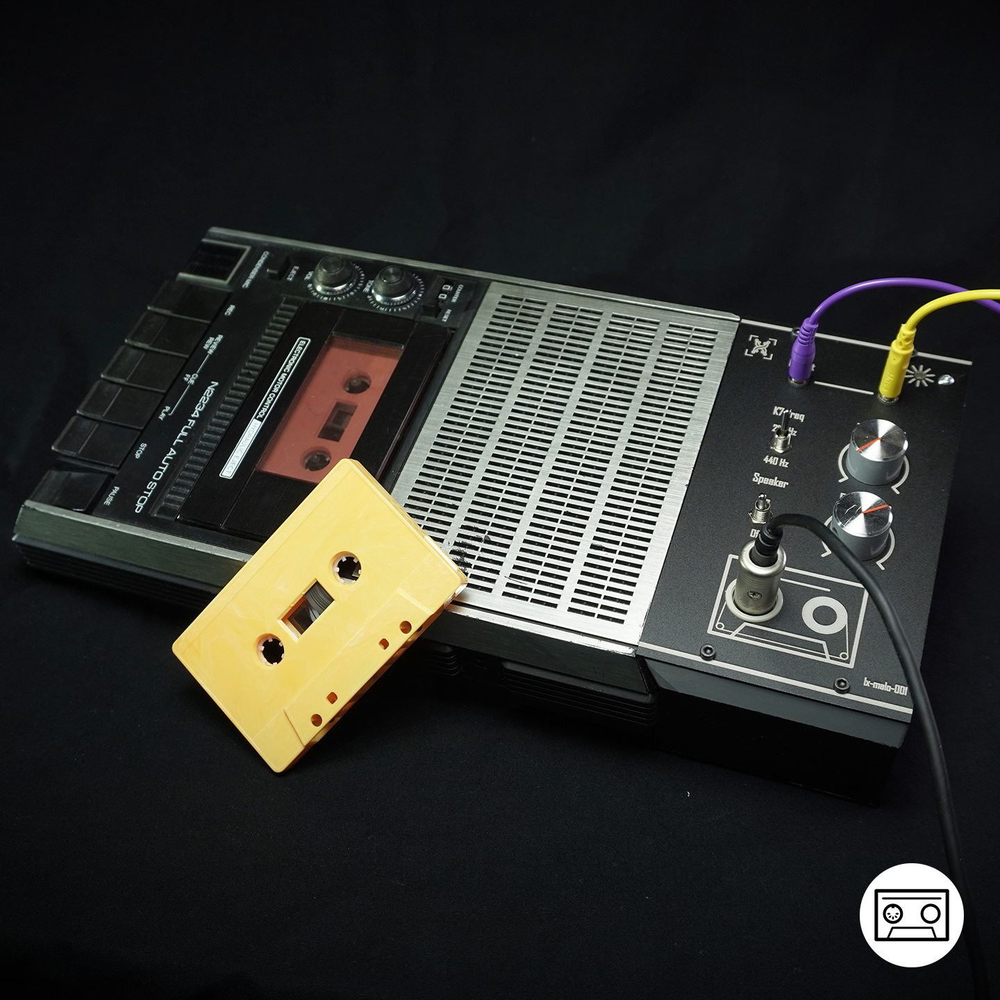

# MIDI-tape

## ManufacturingFiles

### Front panel
The manufacturing files of the front panel have been made to cnc machine and laser engrave a front panel. They can also be easily converted to make the front panel of a PCB which is a cheaper option.
The Front panel is composed of the following files:
- FrontFace_V001.dxf	: silkscreen of front panel used for laser engraving
- FrontFace_V001.step	: 3d files of the front panel
- FrontFace_V001.png	: png version of the "silkscreen" of the front panel 

In my original design, the front panel has been made using [PCBWay](https://www.pcbway.com) Sheet Metal Fabrication service. I chose bead-blasted black anodized aluminum with custom laser engraving.

### 3D printed parts

3 parts of the MIDI-tape are 3D printed:
- Neopixel holder.3mf : a single neopixel pcb holder
- PCB_Holder.3mf : a frame to holde the main pcb
- PotDiameterAdapter.3mf : a little diameter adapter for the potentiometer shaft
- Contour.3mf : the main 3d printed part  that will hold 
